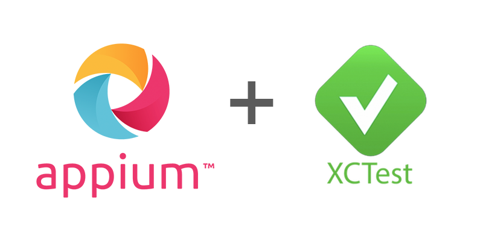

## Appium XCUITest Driver

<p align="center">
   <a href="https://appium.github.io/appium-xcuitest-driver/">
      
   </a>
</p>

<div align="center">

[](https://npmjs.org/package/appium-xcuitest-driver)
[](https://npmjs.org/package/appium-xcuitest-driver)
[](https://github.com/appium/appium-xcuitest-driver/actions/workflows/publish.js.yml)

</div>

---

<p align="center"><b>
   <a href="https://appium.github.io/appium-xcuitest-driver/">Documentation</a> |
   <a href="https://appium.github.io/appium-xcuitest-driver/latest/getting-started/">Get Started</a> |
   <a href="https://github.com/appium/appium-xcuitest-driver/blob/master/CHANGELOG.md">Changelog</a>
</b></p>

---

This is an Appium driver for automating native and hybrid applications on iOS, iPadOS, and tvOS.

> [!IMPORTANT]
> Since major version *10.0.0*, this driver is only compatible with Appium 3.


## Documentation

You can access the documentation here: [**https://appium.github.io/appium-xcuitest-driver**](https://appium.github.io/appium-xcuitest-driver)

### Optional: CodeGraph for local code navigation

If you want a local semantic index for this repository, you can install [CodeGraph](https://github.com/colbymchenry/codegraph) locally and initialize it in the repo:

```bash
curl -fsSL https://raw.githubusercontent.com/colbymchenry/codegraph/v1.5.0/install.sh | sh
cd "<project folder>"
codegraph install
codegraph init
```

CodeGraph builds a local knowledge graph of symbols and call paths so AI coding agents, like Cursor or Claude, can answer questions and navigate the codebase faster with fewer file reads and reduced token consumption.
