This page shows the high-level request path when automating iOS/tvOS with the Appium XCUITest Driver, from a client library (for example Java or Python) down to XCTest on the target device.

The diagram below is intentionally the simplest end-to-end example. Cloud service providers, device farms, network gateways, and sophisticated local setups may insert additional layers between the client library and the automation host.

## End-to-End Architecture

```mermaid
flowchart LR
  subgraph ClientSide["Test Client"]
    T["Test Code"]
    CL["Appium Client Library<br/>(Java / Python / JS / Ruby / C#)"]
  end

  subgraph ServerHost["Automation Host"]
    AS["Appium Server"]
    XD["XCUITest Driver<br/>(appium-xcuitest-driver)"]
    HW["WebDriverAgent Management"]
  end

  subgraph Target["Simulator / Real Device"]
    WDAS["WebDriverAgent Server"]
    XCT["XCTest Runtime"]
    AUT["Application Under Test"]
  end

  T --> CL
  CL -->|"W3C WebDriver over HTTP"| AS
  AS -->|"Routes iOS commands"| XD
  XD -->|"Starts/monitors WDA, proxies commands"| HW
  HW -->|"Xcodebuild / deployment / launch"| WDAS
  WDAS -->|"XCTest automation APIs"| XCT
  XCT -->|"UI interactions + assertions"| AUT

  AUT -->|"UI state/result"| XCT
  XCT --> WDAS
  WDAS --> XD
  XD --> AS
  AS --> CL
  CL --> T
```

## Command Flow at Runtime

1. The test sends a command via a client library (for example `findElement`, `click`, or `executeScript`).
2. The Appium server forwards the command to this driver based on the active session.
3. The XCUITest driver translates/proxies the command to WebDriverAgent (WDA), and manages WDA lifecycle when needed.
4. WDA uses XCTest internals to drive the app UI on simulator or real device.
5. The result comes back through the same chain to the client.

## Transport and Responsibilities

- Client library to Appium server: W3C WebDriver HTTP protocol.
- Appium server to this driver: in-process driver command dispatch.
- This driver to WDA: HTTP proxying to the WDA REST API.
- WDA to XCTest/device: native Apple automation stack.
