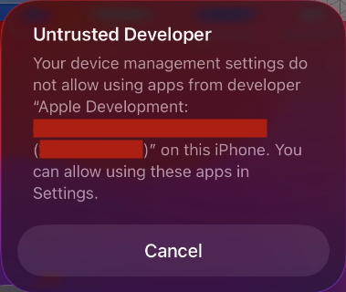

The XCUITest driver communicates with the device under test through the
`WebDriverAgentRunner-Runner` (WDA) helper application, which the driver can automatically build and
install on the device. For real devices, Apple requires all apps to have a valid provisioning
profile before they can be installed, which means that the WDA app must first be signed and linked
to a development team. This guide describes how to accomplish this.

## Apple Account

A key prerequisite for signing WDA is ^^an Apple Account^^. Free and paid accounts are both
supported. Note that there are two cases where you may not need an account:

* Your device already [already has WDA installed](../../guides/run-preinstalled-wda.md)
* You already have [a prebuilt WDA](../../guides/run-prebuilt-wda.md) on your local system

Once you have an Apple Account, there are several approaches you can take.

## Automatic Configuration

The automatic configuration approach allows creating a provisioning profile without the need to
configure WDA itself. However, ^^it is only supported for paid Apple Developer accounts^^.

> Read the full guide: [Automatic Provisioning Profile Configuration](./auto-config.md)

## Manual Configuration

Free Apple Accounts are still able to sign WDA and link it to their default personal team. There
are several ways of doing this, but all of them involve working with the WDA application, or more
specifically, its Xcode project, which is installed alongside the XCUITest driver.

The driver includes a convenience script to automatically open the WDA project in Xcode:
```
appium driver run xcuitest open-wda
```

The script will also print the full path to the project file, which you may want to use in later
steps. The project file is located in the XCUITest driver install directory:
```
<path/to/xcuitest/driver>/node_modules/appium-webdriveragent/WebDriverAgent.xcodeproj
```

Once Xcode is open, make sure to add your Apple Account in the settings:
 > _Xcode_ -> _Settings_ -> _Apple Accounts_ -> _Add Apple Account..._

Now you can configure the WDA project using one of the manual configuration approaches:

* Basic configuration: create a new project, then use its provisioning profile and bundle ID

    > Read the full guide: [Basic Manual Provisioning Profile Configuration](./basic-manual-config.md)

* Full configuration: associate the provisioning profile directly with the WDA project

    > Read the full guide: [Full Manual Provisioning Profile Configuration](./full-manual-config.md)

* Generic device configuration: manually run `xcodebuild` to build WDA, then manually install it

    > Read the full guide: [Manual Provisioning Profile Configuration for a Generic Device](./generic-device-config.md)

## Common Issues

At this point you should have either tried to start a session with provisioning profile-related
capabilities (for automatic config), or tried to build and install WDA through Xcode (for manual
config). If this did not succeed, you likely have one of the following problems. For issues not
listed here, please refer to the [Troubleshooting](../../troubleshooting/index.md) page.

### xcodebuild exited with code 65

  This can happen during automatic configuration, or when a manually configured provisioning profile
  is revoked (for example, due to expiration). It means that code signing is not set up correctly and
  must be reconfigured. Follow the steps in any of the manual configuration approaches to fix this.

### xcodebuild exited with code 70

  Similarly to the error for code 65, this error can be caused by invalid code signing, but may
  also be returned in case of invalid `xcodebuild` configuration (for example, wrong platform
  version). To fix this, check if code signing is set up properly, and verify that any custom build
  parameters have valid values.

### Developer App Certificate is not trusted

  This error can appear in Xcode when building WDA during manual configuration with a free Apple
  Account. A similar error will also appear if you manually try to open the WDA app on the device:

  

  You can fix this by allowing your device to accept apps from your personal development team.
  Note that this requires the device to have an internet connection.
  
  1. On the device, open _Settings_ -> _General_ -> _VPN & Device Management_
  2. You should see a new _Developer App_ section, listing the Apple Account email used to build WDA. Select it.
  3. Tap _Trust {email}_ -> _Allow_

  You can find additional information in the related [Apple documentation guide](https://support.apple.com/en-us/118254).

## Offline Provisioning Profile

Since iOS 16, Apple requires a device to have a live internet connection for validating the code
signing. It is possible to set up an offline enabled provisioning profile, which allows you to avoid
the limitation, although such profiles are only valid for up to 7 days. Please read
[this issue](https://github.com/appium/appium/issues/18378#issuecomment-1482678074) regarding
detailed configuration steps.

## Improve WebDriverAgent Startup Performance

Building WDA upon every session startup may add up to a significant amount of time. The driver
offers a few methods to speed this up, with or without using `xcodebuild`. Some approaches may
require a deeper understanding of the iOS development environment.

- [Run Preinstalled WebDriverAgentRunner](../../guides/run-preinstalled-wda.md)
- [Run Prebuilt WebDriverAgentRunner](../../guides/run-prebuilt-wda.md)
- [Attach to a Running WebDriverAgent](../../guides/attach-to-running-wda.md)
