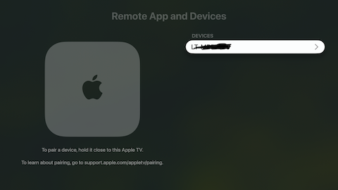
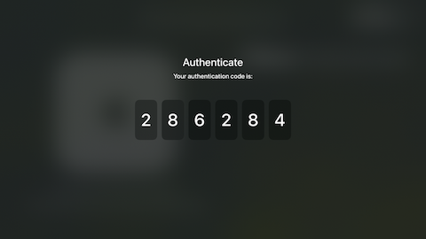

This guide explains how to pair tvOS (Apple TV HD/4K) devices over WiFi, so that these devices can
be recognized and automated by the XCUITest driver.

All pairing-related functionality (pairing protocol, discovery, and credential storage) is
implemented in the optional [`appium-ios-remotexpc`](https://github.com/appium/appium-ios-remotexpc/)
library. The XCUITest driver provides a small wrapper script around this functionality.

!!! info

    Pairing functionality is only supported for devices running ^^tvOS 18 or later^^. For devices on
    older tvOS versions, refer to [the Device Setup guide](./device-setup.md#wireless-tvos-devices).

## Prerequisites

- Apple TV device running tvOS 18 or later
- macOS machine on the same local network
- Network connectivity between both devices (no firewall blocking)
- XCUITest driver version 10.30.0 or later
- `appium-ios-remotexpc` version 0.13.0 or later

## Step 1: Enable Discovery Mode

In order to pair an Apple TV device, it must be first placed in discovery mode. This can be done
through the tvOS user interface:

> _Settings_ -> _Remotes and Devices_ -> _Remote App and Device_

The Apple TV should now be in discovery mode for a limited time:



## Step 2: Run Pairing Command

You can now run the driver script to pair the devices - note that it must be run in `sudo` mode.

```bash
sudo appium driver run xcuitest pair-appletv
```

The above command will return a prompt for selecting a specific device. You can also skip
interactive selection by using the `--device` option. See [the Scripts reference page](../reference/scripts.md#pair-appletv)
for more information.

```bash
sudo appium driver run xcuitest pair-appletv -- --device "Living Room"
sudo appium driver run xcuitest pair-appletv -- --device 0
sudo appium driver run xcuitest pair-appletv -- --device AA:BB:CC:DD:EE:FF
```

The script will then execute the HAP-based pairing flow, and prompt for a pairing PIN.

## Step 3: Enter Pairing PIN

After running the script, the Apple TV should display a pairing PIN:



When prompted, enter this PIN into the script's terminal, which will finalise the pairing process.

Upon successful pairing, the script will print an identifier for the paired Apple TV device. This
identifier _is different from the device's standard UDID_, and should be used _instead of the
standard UDID_ for all future actions, such as creating a RemoteXPC tunnel or client session.

## More Information

For additional details on this procedure (discovery, cryptography, credential storage,
troubleshooting), refer to [the full pairing guide](https://github.com/appium/appium-ios-remotexpc/blob/main/docs/apple-tv-pairing-guide.md)
in the `appium-ios-remotexpc` project.
