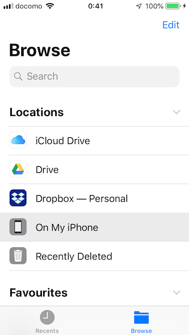
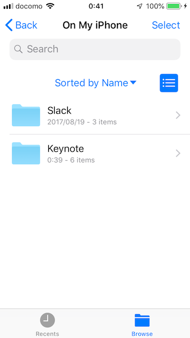
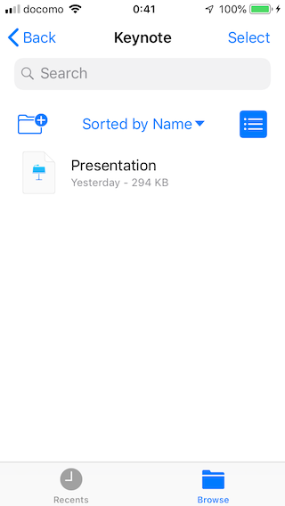

The XCUITest driver provides several [extension commands](../reference/execute-methods.md) for file transfer:

* [`mobile: pullFolder`](../reference/execute-methods.md#mobile-pullfolder)
* [`mobile: pullFile`](../reference/execute-methods.md#mobile-pullfile)
* [`mobile: pushFile`](../reference/execute-methods.md#mobile-pushfile)
* [`mobile: deleteFolder`](../reference/execute-methods.md#mobile-deletefolder)
* [`mobile: deleteFile`](../reference/execute-methods.md#mobile-deletefile)

This documentation aims to help to understand how they work on iOS.

## Formats

All commands require a parameter with a path to the file/folder on the target device. There are 3
possible formats this path can take:

### Format 1

```
@<app-bundle-id>:<container-type>/<path-to-file-or-folder>
```

* `@<app-bundle-id>` is the application bundle identifier
* `<container-type>` is the container type
    * On simulators, common values are `app`, `data`, `groups`, but a custom one can also be provided
    * On real devices, the only accepted value is `documents`. All others are treated as Format 2
        * This value can only be specified for apps that have the `UIFileSharingEnabled` flag set to
          `true`. You can use the [`mobile: listApps`](../reference/execute-methods.md#mobile-listapps)
          extension to identify such apps.
        * `skipDocumentsContainerCheckInFileManagement` Settings API could ignore this flag check.

* `<path-to-file-or-folder>` is the target file or folder
    * On real devices, if `<container-type>` is set to `documents`, this path will be mapped to
      `On My iPhone/<app name>` in the _Files_ app

### Format 2

```
@<app-bundle-id>/<path-to-file-or-folder>
```

* On simulators, the implicit `<container-type>` is set to `app`.
* On real device, only apps with the `UIFileSharingEnabled` flag set to `true` in their `info.plist`
  can be mounted. You can use the [`mobile: listApps`](../reference/execute-methods.md#mobile-listapps)
  extension to identify such apps.

### Format 3

```
<path-to-file-or-folder>
```

This format is only supported on simulators. The implicit `<container-type>` is set to `app`.
Eventually the whole simulator file system is
[available](https://stackoverflow.com/questions/6480607/is-there-any-way-to-see-the-file-system-on-the-ios-simulator)
directly from the macOS Finder, so you may pull any file from there by providing a path to it
relatively to the simulator's file system root.

## Examples

### `pullFile`

This example pulls a file present in _Files -> On My iPhone -> Keynote_:

|Top | On  My iPhone | Keynote |
|:----:|:----:|:----:|
||||

=== "JS (WebdriverIO)"

    ```javascript
    let data = driver.pullFile('@com.apple.Keynote:documents/Presentation.key');
    await fs.writeFile('presentation.key', Buffer.from(data, 'base64'), 'binary');
    ```

=== "Ruby"

    ```ruby
    file = @driver.pull_file '@com.apple.Keynote:documents/Presentation.key'
    File.open('presentation.key', 'wb') { |f| f<< file }
    ```

If the file is in deeper place like _Keynote/Dir1/Dir2_, then the path changes:

=== "JS (WebdriverIO)"

    ```javascript
    let data = driver.pullFile('@com.apple.Keynote:documents/Dir1/Dir2/Presentation.key');
    await fs.writeFile('presentation.key', Buffer.from(data, 'base64'), 'binary');
    ```

=== "Ruby"

    ```ruby
    file = @driver.pull_file '@com.apple.Keynote:documents/Dir1/Dir2/Presentation.key'
    File.open('presentation.key', 'wb') { |f| f<< file }
    ```

Example for a simulator using Format 3:

```java
// Java
// Get AddressBook.sqlitedb in test app package ('app' container)
byte[] fileContent = driver.pullFile("Library/AddressBook/AddressBook.sqlitedb");
Path dstPath = Paths.get(new File("/local/path/AddressBook.sqlitedb"));
Files.write(dstPath, fileContent);
```

### `pullFolder`

You can pull folders similarly to files, but the path must end with a forward slash (`/`).

=== "JS (WebdriverIO)"

    ```javascript
    let data = driver.pullFolder('@com.apple.Keynote:documents/');
    await fs.writeFile('documents.zip', Buffer.from(data, 'base64'), 'binary');
    ```

=== "Ruby"

    ```ruby
    file = @driver.pull_folder '@com.apple.Keynote:documents/'
    File.open('documents.zip', 'wb') { |f| f<< file }
    ```

### `pushFile`

=== "JS (WebdriverIO)"

    ```javascript
    driver.pushFile('@com.apple.Keynote:documents/text.txt', new Buffer("Hello World").toString('base64'));
    ```

=== "Ruby"

    ```ruby
    @driver.push_file '@com.apple.Keynote:documents/text.txt', (File.read 'path/to/file')
    ```

## References
- <https://stackoverflow.com/questions/1108076/where-does-the-iphone-simulator-store-its-data>
- <https://stackoverflow.com/questions/48884248/how-can-i-add-files-to-the-ios-simulator>
- <https://apple.stackexchange.com/questions/299413/how-to-allow-the-files-app-to-save-to-on-my-iphone-or-to-on-my-ipad-in-ios/299565#299565>
