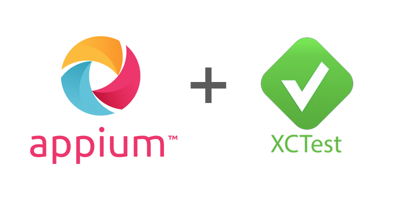

  

The Appium XCUITest Driver is a combined solution, which allows performing automated black-box testing of iOS and tvOS native applications and WebKit web views.
The native testing is based on Apple's [XCTest](https://developer.apple.com/documentation/xctest) framework and the fork of Facebook's [WebDriverAgent](https://github.com/appium/WebDriverAgent) server (the [original](https://github.com/facebookarchive/WebDriverAgent) project is not supported anymore).
Web views communication is done via [Webkit remote debugger protocol](https://github.com/appium/appium-remote-debugger). Real devices communication is ensured by [appium-ios-device](https://github.com/appium/appium-ios-device) library.
Simulators communication is ensured by [appium-ios-simulator](https://github.com/appium/appium-ios-simulator) library.

In the native mode the driver operates in scope of [WebDriver W3C protocol](https://w3c.github.io/webdriver) with several platform-specific extensions. Web views communication only supports the obsolete [JWP protocol](https://webdriver.io/docs/api/jsonwp.html).

Use the navigation on the left or proceed to [Setup](setup.md)!
