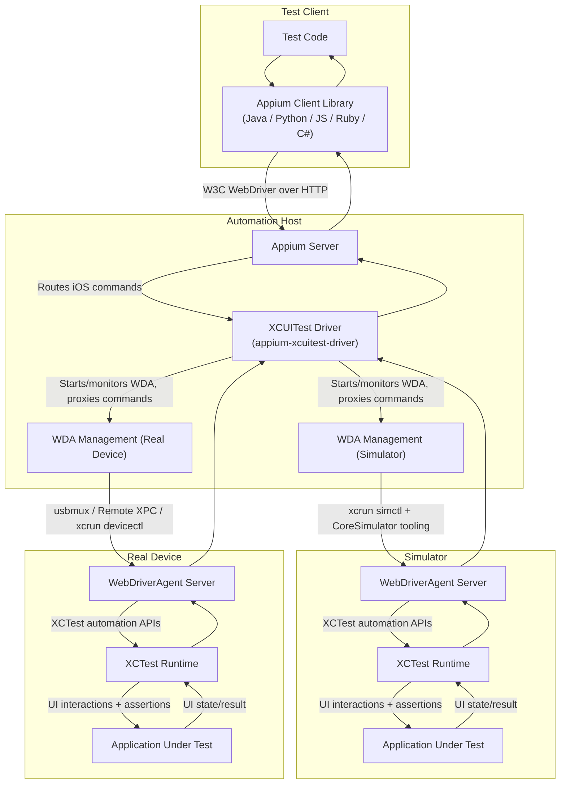

---
hide:
  - navigation

title: Overview
---

The XCUITest driver is an Appium driver intended for black-box automated testing of several Apple
ecosystem platforms.

## Target Platforms

The driver supports the following Apple platforms as automation targets:

|Platform|Simulators|Real devices|
|--|--|--|
|iOS|:white_check_mark:|:white_check_mark:|
|iPadOS|:white_check_mark:|:white_check_mark:|
|tvOS|:white_check_mark:|:white_check_mark:|
|watchOS|:x:|:x:|
|visionOS|:x:|:x:|
|macOS|N/A|:x: [^macos]|
|Safari (mobile)|:white_check_mark: [^safari-mob]|:white_check_mark: [^safari-mob]|
|Safari (desktop)|:x: [^safari-desktop]|:x: [^safari-desktop]|

A detailed breakdown of the supported platform versions can be found in [the Installation page](./getting-started/system-requirements.md#driver-version).

## Contexts

The following application contexts are supported for automation:

- Native applications
- Webviews based on Safari
- Webviews based on Chrome ([since Chrome 115 & iOS 16.4](https://developer.chrome.com/blog/debugging-chrome-on-ios/))
- Hybrid applications

Note that [only debuggable webviews](./troubleshooting/index.md#unable-to-detect-webview) are supported.

## Technologies Used

Under the hood, the driver combines several different technologies to achieve its functionality:

- Native testing
    - Based on Apple's [XCTest](https://developer.apple.com/documentation/xctest) framework
    - Provided by the [`appium-webdriveragent`](https://github.com/appium/WebDriverAgent) library
      (a fork of [the original implementation by Facebook](https://github.com/facebookarchive/WebDriverAgent))
    - Uses the [W3C WebDriver protocol](https://w3c.github.io/webdriver) with several platform-specific extensions
- Webview testing
    - Based on Safari's WebKit Remote Debugger Protocol (not officially documented)
    - Provided by the [`appium-remote-debugger`](https://github.com/appium/appium-remote-debugger) library
    - Interaction with webpages is based on [Selenium atoms](https://github.com/SeleniumHQ/selenium/tree/trunk/javascript/atoms)
    - Can only use the legacy [JSONWP protocol](https://www.selenium.dev/documentation/legacy/json_wire_protocol/) due to the atoms
    - Better, WebDriver protocol-compatible support is also provided by the [Appium Safari driver](https://github.com/appium/appium-safari-driver)
- Simulator communication
    - Based on the `xcrun simctl` and other `xcrun` command line utility calls
    - Provided by the [`appium-ios-simulator`](https://github.com/appium/appium-ios-simulator) library
- Real device communication
    - Legacy approach (to be eventually deprecated)
        - Based on re-implemented [`libimobiledevice`](https://github.com/libimobiledevice/libimobiledevice) system calls
        - Provided by the [`appium-ios-device`](https://github.com/appium/appium-ios-device) library
    - Modern approach (iOS/tvOS 18+ only)
        - Based on remote XPC services
        - Provided by the [`appium-ios-remotexpc`](https://github.com/appium/appium-ios-remotexpc/) library

## End-to-End Architecture

The diagram below is intentionally the simplest end-to-end example. Cloud service providers, device farms, network gateways, and sophisticated local setups may insert additional layers between the client library and the automation host.

### Command Flow at Runtime

1. The test sends a command via a client library (for example `findElement`, `click`, or `executeScript`).
2. The Appium server forwards the command to this driver based on the active session.
3. The XCUITest driver translates/proxies the command to [WebDriverAgent (WDA)](https://github.com/appium/WebDriverAgent), and manages WDA lifecycle when needed.
4. WDA uses [XCTest](https://developer.apple.com/documentation/xctest?language=objc) internals to drive the app UI on simulator or real device.
5. The result comes back through the same chain to the client.

### Transport and Responsibilities

- Client library to Appium server: W3C WebDriver HTTP protocol.
- Appium server to this driver: in-process driver command dispatch.
- This driver to [WDA](https://github.com/appium/WebDriverAgent): HTTP proxying to the WDA REST API.
- [WDA](https://github.com/appium/WebDriverAgent) to [XCTest](https://developer.apple.com/documentation/xctest?language=objc): native Apple automation stack.
- This driver to real devices: host-device communication uses `usbmux`-based transport, Remote XPC tunneling, and `xcrun devicectl` depending on iOS/tvOS version and environment setup.
- This driver to simulators: host-simulator communication uses `xcrun simctl` (plus related CoreSimulator tooling).

[^macos]: Supported by the [Appium Mac2 driver](https://github.com/appium/appium-mac2-driver)
[^safari-mob]: Also supported by the [Appium Safari driver](https://github.com/appium/appium-safari-driver)
[^safari-desktop]: Supported by the [Appium Safari driver](https://github.com/appium/appium-safari-driver)
