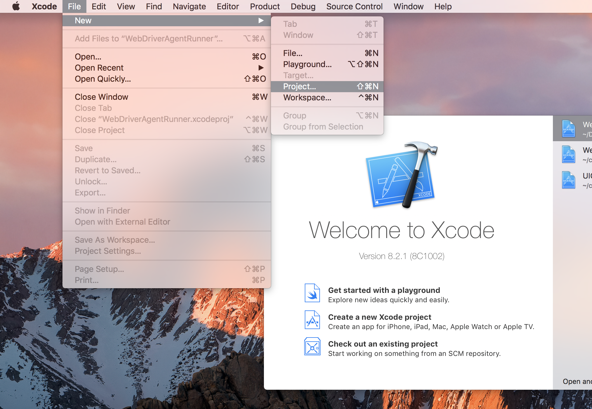

---
hide:
  - toc

title: Basic Manual Configuration
---

There are many cases in which the basic automatic configuration is not enough. Often this happens
when the development account being used is a "Free" one, in which case it is not possible to create
a wildcard provisioning profile.

You can confirm this by opening the WDA project in Xcode. The issue will manifest as something like
an error that Xcode failed to create provisioning profile:

The easiest way around this is to create a new project:

The type does not matter, other than it being "iOS". "Single View Application" is the easiest:

The important part is to use a unique "Product Name" and "Organization Name". Also, at this point,
specify your "Team".

You can confirm that the provisioning profile was created by looking at the "Project" tab:

Or by going into your account preferences and seeing the provisioning profile:

At this point you have a valid provisioning profile. Make note of the bundle identifier
you associated with it, and add that in the `updatedWDABundleId` capability for your tests.
Then follow the [initial instructions for automatic configuration](./prov-profile-basic-auto.md).
