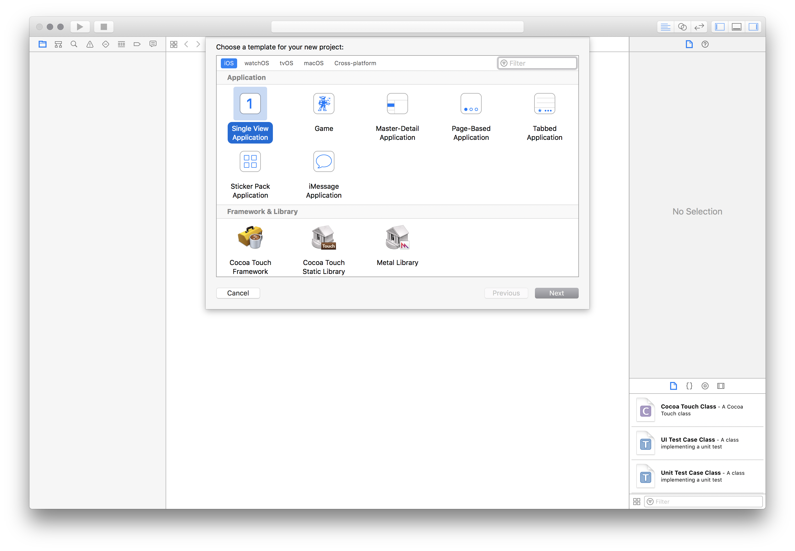
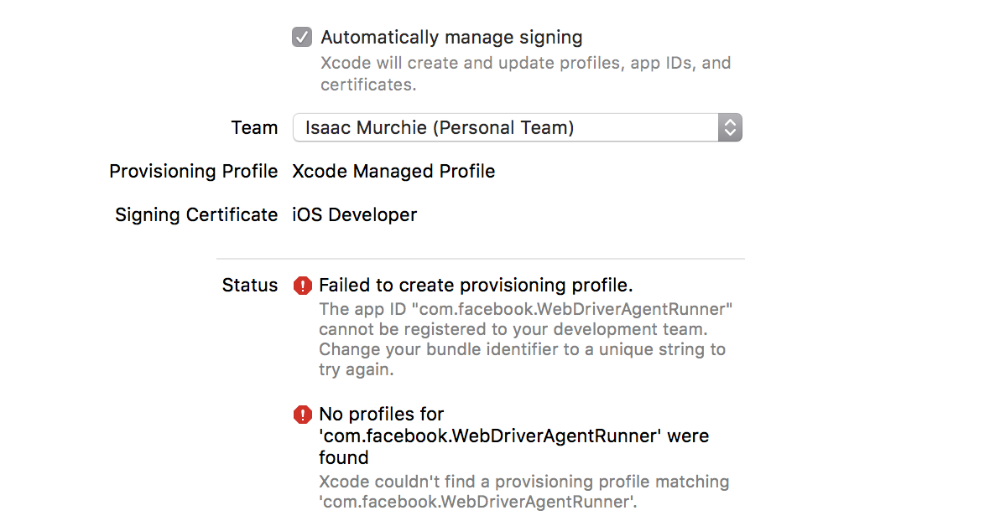

## Setting up iOS Real Devices Tests with XCUITest

### Basic (automatic) configuration

The easiest way to get up-and-running with Appium's XCUITest support on iOS
real devices is to use the automatic configuration strategy. There are two ways
to do this:

*   Use the `xcodeOrgId` and `xcodeSigningId` [capabilities](../README.md#webdriveragent):
```json
    {
      "xcodeOrgId": "<Team ID>",
      "xcodeSigningId": "iPhone Developer"
    }
```
*   Create a `.xcconfig` file somewhere on your file system and add the following to it:
```ini
    DEVELOPMENT_TEAM = <Team ID>
    CODE_SIGN_IDENTITY = iPhone Developer
```
In either case, the Team ID is a unique 10-character string generated by Apple
that is assigned to your team. You can find your Team ID using your developer
account. Sign in to [developer.apple.com/account](https://developer.apple.com/account),
and click Membership in the sidebar. Your Team ID appears in the Membership
Information section under the team name. You can also find your team ID listed
under the "Organizational Unit" field in your iPhone Developer certificate in
your keychain.

Note that these are mutually exclusive strategies; use _either_ the
`xcodeConfigFile` capability or the combination of `xcodeOrgId` and `xcodeSigningId`.

Once this configuration is done, it should just be a matter of starting your test
specifying a real device in your `udid` desired capability.

If this has not worked it will usually manifest itself in the Appium server logs
as some error followed by `info XCUITest xcodebuild exited with code '65' and
signal 'null'`. This usually means that the necessary code signing is not set up
correctly. Go on to the [Basic (manual) configuration](#basic-manual-configuration)
to fix.

If the `WebDriverAgentRunner` is successfully installed on the device, but in the
Appium logs there is an error message something like:
```
2017-01-24 09:02:18.358 xcodebuild[30385:339674] Error Domain=com.apple.platform.iphoneos Code=-12 "Unable to launch com.apple.test.WebDriverAgentRunner-Runner" UserInfo={NSLocalizedDescription=Unable to launch com.apple.test.WebDriverAgentRunner-Runner, NSUnderlyingError=0x7fa839cadc60 {Error Domain=DTXMessage Code=1 "(null)" UserInfo={DTXExceptionKey=The operation couldn’t be completed. Unable to launch com.apple.test.WebDriverAgentRunner-Runner because it has an invalid code signature, inadequate entitlements or its profile has not been explicitly trusted by the user. : Failed to launch process with bundle identifier 'com.apple.test.WebDriverAgentRunner-Runner'}}}
2017-01-24 09:02:18.358 xcodebuild[30385:339674] Error Domain=IDETestOperationsObserverErrorDomain Code=5 "Early unexpected exit, operation never finished bootstrapping - no restart will be attempted" UserInfo={NSLocalizedDescription=Early unexpected exit, operation never finished bootstrapping - no restart will be attempted}

Testing failed:
	Test target WebDriverAgentRunner encountered an error (Early unexpected exit, operation never finished bootstrapping - no restart will be attempted)
```
The problem is that the developer is not trusted on the device. If you manually
try to run the `WebDriverAgentRunner` app on the device, you will see a popup
message:


You can go to Settings => General => Device Management on the device to trust
the developer and allow the `WebDriverAgentRunner` app to be run (see [Apple
documentation for more information](https://support.apple.com/en-us/HT204460)).


### Basic (manual) configuration

There are many cases in which the basic automatic configuration is not enough. This
usually has to do with code signing and the configuration of the project to be
able to be run on the real device under test. Often this happens when the
development account being used is a "Free" one, in which case it is not possible
to create a wildcard provisioning profile, and will often not create one for the
default application bundle.

This will manifest as something like an error that Xcode **failed to create
provisioning profile**:


The easiest way around this is to create a provisioning profile by opening
[Xcode](https://developer.apple.com/xcode/) and creating a new project:


The type does not matter, other than it being "iOS". "Single View Application"
is the easiest:



The important part is to use a unique "Product Name" and "Organization Name". Also,
at this point, specify your "Team".


You can confirm that the provisioning profile was created by looking at the "Project"
tab:


Or by going into your account preferences and seeing the provisioning profile:


At this point you have a valid provisioning profile. Make note of the bundle id
you associated with it, and add that in the `updatedWDABundleId` desired
capability for your tests. Then follow the [initial instructions for automatic
configuration](#basic-automatic-configuration).


### Full manual configuration

Alternatively, the provisioning profile can be manually associated with the
project (keep in mind that this will have to be done each time the `WebDriverAgent`
is updated, and is _not_ recommended):

*   Read [Finding WebDriverAgent project root on the local file system](#finding-webdriveragent-project-root-on-the-local-file-system) to locate where WebDriverAgent
    is installed.
    You could also see the full path to WebDriverAgent's folder in Appium server logs
    after a session has been started.
    Open a terminal and go to that location, then run the following to
    set the project up:
```bash
    mkdir -p Resources/WebDriverAgent.bundle
```
If you build WebDriverAgent with a version before 2.32.0 (e.g. as part of
an Appium release before 1.20.0) you also have to run
```bash
    ./Scripts/bootstrap.sh -d
```
*   Open `WebDriverAgent.xcodeproj` in Xcode. For **both** the `WebDriverAgentLib`
    and `WebDriverAgentRunner` targets, select "Automatically manage signing"
    in the "General" tab, and then select your `Development Team`. This
    should also auto select `Signing Ceritificate`. The outcome should look as
    shown below:
    

    * Xcode may fail to create a provisioning profile for the `WebDriverAgentRunner`
      target:

      

    * This necessitates manually changing the bundle id for the target by going
      into the "Build Settings" tab, and changing the "Product Bundle Identifier"
      from `com.facebook.WebDriverAgentRunner` to something that Xcode will accept:

      

    * Going back to the "General" tab for the `WebDriverAgentRunner` target, you
      should now see that it has created a provisioning profile and all is well:

      

*   Finally, you can verify that everything works. Build the project:
```bash
    xcodebuild build-for-testing test-without-building -project WebDriverAgent.xcodeproj -scheme WebDriverAgentRunner -destination 'id=<udid>'
```
If this was successful, the output should end with something like:
```
    Test Suite 'All tests' started at 2017-01-23 15:49:12.585
    Test Suite 'WebDriverAgentRunner.xctest' started at 2017-01-23 15:49:12.586
    Test Suite 'UITestingUITests' started at 2017-01-23 15:49:12.587
    Test Case '-[UITestingUITests testRunner]' started.
        t =     0.00s     Start Test at 2017-01-23 15:49:12.588
        t =     0.00s     Set Up
```
*   To completely verify, you can try accessing the `WebDriverAgent` server status
    (**note:** you _must_ be on the same network as the device, and know its IP
    address, from Settings => Wi-Fi => Current Network):
```
    export DEVICE_URL='http://<device IP>:8100'
    export JSON_HEADER='-H "Content-Type: application/json;charset=UTF-8, accept: application/json"'
    curl -X GET $JSON_HEADER $DEVICE_URL/status
```
You ought to get back output something like this:
```json
    {
      "value" : {
        "state" : "success",
        "os" : {
          "name" : "iOS",
          "version" : "10.2"
        },
        "ios" : {
          "simulatorVersion" : "10.2",
          "ip" : "192.168.0.7"
        },
        "build" : {
          "time" : "Jan 23 2017 14:59:57"
        }
      },
      "sessionId" : "8951A6DD-F3AD-410E-A5DB-D042F42F68A7",
      "status" : 0
    }
```

#### Build for Generic iOS/tvOS devices, run manually

Alternatively, you can build `WebDriverAgentRunner` for a generic iOS/tvOS device, and install the generated `.app` package to a real device.
Building for a generic device means the package could be installed on any iOS or tvOS device depending on the chosen platform.

```bash
# iOS
$ xcodebuild clean build-for-testing -project WebDriverAgent.xcodeproj -derivedDataPath appium_wda_ios -scheme WebDriverAgentRunner -destination generic/platform=iOS CODE_SIGNING_ALLOWED=YES

# tvOS
$ xcodebuild clean build-for-testing -project WebDriverAgent.xcodeproj -derivedDataPath appium_wda_tvos -scheme WebDriverAgentRunner_tvOS -destination generic/platform=tvOS CODE_SIGNING_ALLOWED=YES
```

On successful completion the resulting package `WebDriverAgentRunner-Runner.app` should be located in `Build/Products/Debug-iphoneos/` subfolder under WebDriverAgent sources root, or in the path provided as `derivedDataPath` argument.

> **Note**
> Please make sure the `WebDriverAgent.xcodeproj` has codesigning properties configured properly according to the above description if the build action fails.
> For example, you may need to configure the bundle id for the provisioning profile properly.

The `WebDriverAgentRunner-Runner.app` can be installed to any real device allowed by the provisioning profile.

You can install the package with 3rd party tools and manage it separately as explained in [How To Set Up And Customize WebDriverAgent Server](./wda-custom-server.md).
If the codesign is not correct, the installation will fail because of the package verification error by iOS.

As a more advanced method, you can generate the package with `CODE_SIGNING_ALLOWED=NO` and do [`codesign`](https://developer.apple.com/documentation/xcode/using-the-latest-code-signature-format) separately by yourself.
This would make the device management more flexible, but you'd need to know about advanced codesign usage scenarios.

> **Note**
> Generic builds with `CODE_SIGNING_ALLOWED=NO` are available for each version tag at https://github.com/appium/WebDriverAgent/releases.
> The packages are able to be sigined with a wildcard (`*`) provisioning profile to make it work. The wildcard requires a paied account.

### Finding WebDriverAgent project root on the local file system

WebDriverAgent Xcode project is bundled with [appium-webdriveragent](https://www.npmjs.com/package/appium-webdriveragent) NPM module. This means as soon as you could find WDA location on the local file system as soon as you know where this npm module has been installed. The module is a direct dependency of [appium-xcuitest-driver](https://www.npmjs.com/package/appium-xcuitest-driver). The actual location of the module on the file system depends on major Appium version and on the way used to install Appium or XCUITest itself. All the below tutorials assume that you use *NPM* (Node Package Manager) to install Appium. We do not officially support other package managers, like yarn or brew, so the actual behavior might be different if you still use them.

#### Appium 1.x

XCUITest driver is the default dependency of Appium 1.x package, so WDA must be located under Appium's installation root. Depending on whether Appium has been installed globally or locally, the package could be find either in a local or a global `node_modules` root. Check [Where does npm install packages? Find the install path](https://sebhastian.com/where-does-npm-install-packages/) article for more details. As soon as you find where `appium` package is located then simply run the lookup for `WebDriverAgent.xcodeproj` in it. For example, if Appium has been installed globally, then the following commands could be used:

```bash
npm i -g appium@1.22.3
echo "$(dirname "$(find "$(npm root -g)/appium/node_modules" -name WebDriverAgent.xcodeproj)")"
```

The resulting output will contain the full path to WDA's source folder.

#### Appium 2.x

In Appium 2.x the server and drivers are separated, so you won't find WDA sources in the same package where the server is installed. WDA sources only get fetched as soon as XCUITest driver is installed using the server CLI, e.g. `appium driver install xcuitest`. Appium server CLI by default installs the driver package using NPM and uses APPIUM_HOME folder as the root. By default, APPIUM_HOME points to `$HOME/.appium`. It could also be customized by providing the corresponding CLI argument. As soon as the driver installation is completed and default values were used the WDA path could be found in one of `APPIUM_HOME` subfolders:

```bash
appium driver install xcuitest
echo "$(dirname "$(find "$HOME/.appium" -name WebDriverAgent.xcodeproj)")"
```

The resulting output will contain the full path to WDA's source folder.
